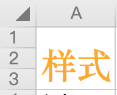

<h1 align='center'>Sheetjs-style</h1>
<p align='center'>
  <a href="https://travis-ci.com/Yoshino-UI/Yoshino/">
    
  </a>
  
  
  
  
</p>
<p align='center'>support set cell style for sheetjs!</p>
<p align='center'>API is the same as sheetjs!</p>

## install
```
npm install sheetjs-style
```

## How to Use?
Please read [SheetJs Documents](https://github.com/SheetJS/sheetjs/blob/3468395494c450ea8ba7e20afb1bd6127f516ccd/README.md)!

## How to set cell Style?
for example:
```js
ws["A1"].s = {									// set the style for target cell
  font: {
    name: '宋体',
    sz: 24,
    bold: true,
    color: { rgb: "FFFFAA00" }
  },
};
```


# Cell Styles

Cell styles are specified by a style object that roughly parallels the OpenXML structure.  The style object has five
top-level attributes: `fill`, `font`, `numFmt`, `alignment`, and `border`.


| Style Attribute | Sub Attributes | Values |
| :-------------- | :------------- | :------------- |
| fill            | patternType    |  `"solid"` or `"none"`
|                 | fgColor        |  `COLOR_SPEC`
|                 | bgColor        |  `COLOR_SPEC`
| font            | name           |  `"Calibri"` // default
|                 | sz             |  `"11"` // font size in points
|                 | color          |  `COLOR_SPEC`
|                 | bold           |  `true` or `false`
|                 | underline      |  `true` or `false`
|                 | italic         |  `true` or `false`
|                 | strike         |  `true` or `false`
|                 | outline        |  `true` or `false`
|                 | shadow         |  `true` or `false`
|                 | vertAlign      |  `true` or `false`
| numFmt          |                |  `"0"`  // integer index to built in formats, see StyleBuilder.SSF property
|                 |                |  `"0.00%"` // string matching a built-in format, see StyleBuilder.SSF
|                 |                |  `"0.0%"`  // string specifying a custom format
|                 |                |  `"0.00%;\\(0.00%\\);\\-;@"` // string specifying a custom format, escaping special characters
|                 |                |  `"m/dd/yy"` // string a date format using Excel's format notation
| alignment       | vertical       | `"bottom"` or `"center"` or `"top"`
|                 | horizontal     | `"left"` or `"center"` or `"right"`
|                 | wrapText       |  `true ` or ` false`
|                 | readingOrder   |  `2` // for right-to-left
|                 | textRotation   | Number from `0` to `180` or `255` (default is `0`)
|                 |                |  `90` is rotated up 90 degrees
|                 |                |  `45` is rotated up 45 degrees
|                 |                | `135` is rotated down 45 degrees
|                 |                | `180` is rotated down 180 degrees
|                 |                | `255` is special,  aligned vertically
| border          | top            | `{ style: BORDER_STYLE, color: COLOR_SPEC }`
|                 | bottom         | `{ style: BORDER_STYLE, color: COLOR_SPEC }`
|                 | left           | `{ style: BORDER_STYLE, color: COLOR_SPEC }`
|                 | right          | `{ style: BORDER_STYLE, color: COLOR_SPEC }`
|                 | diagonal       | `{ style: BORDER_STYLE, color: COLOR_SPEC }`
|                 | diagonalUp     | `true` or `false`
|                 | diagonalDown   | `true` or `false`

**COLOR_SPEC**: Colors for `fill`, `font`, and `border` are specified as objects, either:
* `{ auto: 1}` specifying automatic values
* `{ rgb: "FFFFAA00" }` specifying a hex ARGB value
* `{ theme: "1", tint: "-0.25"}` specifying an integer index to a theme color and a tint value (default 0)
* `{ indexed: 64}` default value for `fill.bgColor`

**BORDER_STYLE**: Border style is a string value which may take on one of the following values:
 * `thin`
 * `medium`
 * `thick`
 * `dotted`
 * `hair`
 * `dashed`
 * `mediumDashed`
 * `dashDot`
 * `mediumDashDot`
 * `dashDotDot`
 * `mediumDashDotDot`
 * `slantDashDot`


Borders for merged areas are specified for each cell within the merged area.  So to apply a box border to a merged area of 3x3 cells, border styles would need to be specified for eight different cells:
* left borders for the three cells on the left,
* right borders for the cells on the right
* top borders for the cells on the top
* bottom borders for the cells on the left
 
## Thanks
[sheetjs](https://github.com/SheetJS/sheetjs)
[js-xlsx](https://github.com/protobi/js-xlsx)
